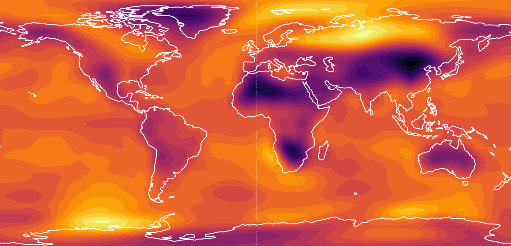

# letkf-speedy

This repository contains an implementation of the [local ensemble transform Kalman filter](http://www.sciencedirect.com/science/article/pii/S0167278906004647) (LETKF) for performing data assimilation with the SPEEDY intermediate complexity atmospheric general circulation model. It is basically a copy of Takemasa Miyoshi's [LETKF repository](https://github.com/takemasa-miyoshi/letkf) with some modifications for reducing precision in the forecast model.

The repository is a standard observing system simulation experiment (OSSE). The model is run once to generate a "nature run", from which synthetic observations are extracted. Then, the LETKF is used to perform data assimilation on these observations every 6 hours.

## Quick setup

### 1. Generate nature run

Go to the `model/run` repository and run `bash run_first.sh` to spin-up the nature model. Then run `bash run_cycle.sh` to run the actual nature run. This will output every 6 hours into the `DATA/nature` directory.

### 2. Generate observations

Go to the `obs` directory and run `bash obsmake.sh` to make the observations. These will be stored in `DATA/obs`.

### 3. Assimilate!

Go to the `letkf/run` directory and first run `bash init.sh`. This builds the LETKF executable and sets up the output folders. Then run `bash run_cycle.sh double` to perform data assimilation with the double precision model or `bash run_cycle.sh reduced` to perform it with the reduced precision model. The output of the assimilation will be stored in `DATA/ensemble`.

## Changing parameters

The file `config.sh` controls the behaviour of the assimilation system.

### Start and end date

The start and end date for the nature run/assimilation cycle can be set with the date parameters at the top of the config file (default: 1st January 1982 - 1st March 1983).

### Ensemble size

The number of ensemble members can be changed with the `n_ens` parameter (default: 20).

### Number of MPI processes

The number of MPI processes to use (and the "batch size" for the ensemble forecast) is set with the `n_procs` parameter (default: 4).

### Resolution of nature run

The resolution of the nature run can be set with the `nat_res` parameter, which currently only accepts `t30` or `t39`. If `t39` is selected, the nature run must be interpolated to T30 before generating the observations. This can be done by running `bash interpolate.sh` in the `interpolate` directory, which interpolates the nature run stored in `DATA/nature_t39` to T30 and stores it in `DATA/nature`.

### Observing network
Two choices of observing network can be selected: `real`, for which observations are located mostly over the Northern Hemisphere continents like for the actual radiosonde network, and `uniform`, for which observations are uniformly distributed around the globe. The network can be chosen through the [`obs_network`](https://github.com/samhatfield/letkf-speedy/blob/56c11a9081a722acf8f81abc11e78846ba2a70c5/config.sh#L31) parameter in `config.sh`
